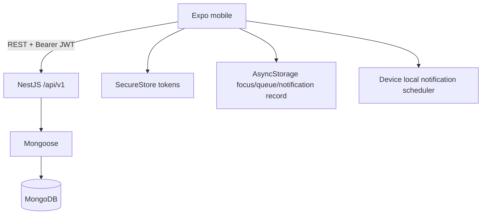

# READ THIS BEFORE MODIFYING THE PROJECT.

## PROJECT

Study Focus App

## CURRENT PURPOSE

A study productivity/accountability mobile application designed primarily to help users remain focused during study sessions and recover quickly when distracted.

## CORE LOOP

```text
START FOCUS
→ WORK
→ RECEIVE PERIODIC LOCAL REMINDER
→ RETURN TO TASK
→ CONTINUE
→ FINISH
→ RECORD REAL STUDY TIME
→ UPDATE GOALS/STREAKS/ANALYTICS
```

This loop is the central product behavior. Reliability of this loop outranks feature breadth, AI, social mechanics, or visual novelty.

## First Facts

- Monorepo: npm workspaces.
- Mobile: Expo SDK 57, React Native 0.86, Expo Router, TypeScript.
- API: NestJS 11 REST API, TypeScript.
- Database: MongoDB through Mongoose 9. **No PostgreSQL, no Prisma.**
- Auth: JWT access/refresh, Passport guard, bcrypt, SecureStore.
- API prefix: `/api/v1`; port 3000 by default.
- Mobile state: TanStack Query for server state; Zustand for auth/focus actions; AsyncStorage focus persistence.
- Reminders: `expo-notifications` local date triggers on the mobile device.
- Current branch at handoff creation: `main`.
- Current committed baseline at handoff creation: `c3ee412`; documentation changes may be a later commit or uncommitted, so run Git commands.
- Native Android notification delivery is not runtime verified because no device/emulator is available.

## Read Order

1. This file.
2. `PROJECT_STATUS.md`.
3. `ARCHITECTURE.md`.
4. `DECISIONS.md`.
5. Relevant technical reference (`API.md`, `DATABASE.md`, `MOBILE_ARCHITECTURE.md`, `FOCUS_ENGINE.md`, `NOTIFICATIONS.md`).
6. Actual source.

Documentation is a map, not authority over source. If code and docs differ, verify Git history/tests and update docs with the fix.

## Repository Structure

```text
apps/
  api/
    src/                 Nest modules, controllers/services, schemas
    scripts/seed.ts      local demo seed
    test/                scaffold e2e
    .env.example
  mobile/
    src/app/             Expo Router screens/layouts
    src/stores/          auth and persisted focus stores
    src/services/        HTTP, resources, notifications, queue
    src/components/      shared UI
    scripts/             two pure TypeScript assertion scripts
    app.json
packages/
  shared/src/index.ts    defaults/status/envelope types
  config/typescript/     base TS config
.github/workflows/ci.yml
```

## Current Architecture



The API owns durable state, authorization, transition validation, and authoritative duration/analytics. The mobile owns current display timing, device reminders, and bounded offline focus continuity.

## Authentication

Backend: `apps/api/src/auth.ts`.

- Register validates email/name/password (minimum 8), lowercases email.
- bcrypt cost 12 for passwords and refresh-token hashes.
- Access and refresh JWTs include `sub`, `email`, and `type`.
- Defaults: access 15m, refresh 30d.
- Only access-token type passes `JwtStrategy`.
- One refresh-token hash is stored per user; issuing/refreshing replaces it.
- Logout nulls the hash.
- Registration creates default `userSettings`; compensates by deleting user on settings failure.

Mobile: `services/api.ts`, `stores/auth-store.ts`.

- Tokens are in SecureStore.
- Axios attaches access token.
- A 401 gets one refresh/retry; concurrent refreshes share a promise.
- Refresh failure clears tokens and auth state.
- Auth/tab/root layouts redirect based on restored identity.

INVARIANT: resource ownership comes from JWT `sub`, never client `userId`.

Known risk: normal logout does not clear/scope focus state, queue, or Query cache. Address before calling multi-account offline behavior safe.

## Database

Schemas live together in `apps/api/src/schemas/index.ts`:

- `users`
- `subjects`
- `tasks`
- `timetableEntries`
- `focusSessions` with embedded `distractions[]`
- `userSettings`
- `studyGoals` (dormant schema; no CRUD API)

Important indexes:

- unique user email
- unique subject name per user
- one userSettings per user
- one `ACTIVE`/`PAUSED` focus session per user
- unique `(userId, clientSessionId)` for offline idempotency
- user/status/date analytics indexes

See `DATABASE.md`.

## API

Nest modules: database, auth, subjects, tasks, timetable, focus, settings, analytics. Production bootstrap globally applies prefix, strict DTO validation, success/error envelopes, CORS, Pino redaction.

Every protected service filters by authenticated owner. Core route families:

- `/auth`
- `/subjects`
- `/tasks`
- `/timetable`
- `/focus-sessions`
- `/settings`
- `/analytics`
- `/health/database`

See `API.md`; do not invent routes from old specifications.

## Mobile App

Expo Router screens cover auth, dashboard, subjects, tasks, timetable, progress, settings, focus start/active/summary. Core screens consume real API data. `sample-data.ts` remains but is not the source for dashboard/timetable/stats.

TanStack Query cache is in-memory. Focus store persists only current/last completed session. Zod/React Hook Form are used on login/register only. `/focus/*` and `/tasks` have no local auth redirect. `packages/shared` and `packages/config` are not imported by the apps.

See `MOBILE_ARCHITECTURE.md`.

## Focus Session Engine

States:

```text
ACTIVE -> PAUSED -> ACTIVE
ACTIVE|PAUSED -> COMPLETED
ACTIVE|PAUSED -> CANCELLED
ACTIVE -> EXPIRED (only after planned end)
```

Terminal states have no transitions.

Server computes actual whole minutes:

```text
floor(max(0, end - start - all pauses) / 60 seconds)
```

Completion percentage is rounded and capped at 100. The UI interval is not a clock source. Online completion does not accept client `actualMinutes`.

See `FOCUS_ENGINE.md`.

## Notifications

`NotificationService` schedules OS date triggers using stable identifiers:

```text
focus-<sessionId>-<fireEpochMs>
```

Production choices: 5/10/15/20/25/30; default 10. One minute is development-only with explicit opt-in.

Pause and every terminal action cancel reminders. Resume rebuilds remaining checkpoints. Startup/foreground reconciles persisted record against native scheduled notifications.

This intentionally does not use the backend. See `NOTIFICATIONS.md`.

## Timetable

Recurring Sunday=0…Saturday=6 entries belong to a subject and optional same-subject task. The mobile derives display status. Server analytics computes adherence by matching a completed same-subject session start within past enabled plan windows.

INVARIANT: timetable entries are plans and never auto-create sessions or analytics.

## Tasks and Subjects

Subjects are unique per user and cannot be deleted while related data exists. Tasks support priority, status, estimates, due/completed timestamps and subject filtering. Services validate referenced ownership.

## Analytics, Goals, Streaks

Only `COMPLETED` sessions enter analytics. API provides daily/weekly/monthly, 7/30/90 history/overview/subject distribution, averages, streak and timetable adherence. Dates group in user timezone.

Streak day threshold comes from `userSettings.minimumStreakMinutes`. Current daily/weekly goal targets also come from `userSettings`.

Important discrepancy: `studyGoals` is seeded but not consumed by any module/API/mobile code.

Overview broad “total” fields and longest streak currently use a 400-day load.

## Settings

Persisted: profile name/timezone, focus/reminder defaults, daily/weekly target, streak minimum, theme, notifications, sound, vibration. Data reset deletes owned study data/settings but keeps account and recreates defaults.

Actually applied:

- profile/timezone
- goal/streak numbers
- focus/reminder defaults
- reset/logout

Partially applied:

- theme remains dark
- sound/vibration notification behavior is static
- notification-enabled flag does not reliably gate every future schedule

## Offline Synchronization

Current active/last completed focus persists. Connection failures create local transitions. Unsynced local session state is upserted as one queue snapshot to `/focus-sessions/sync`. Server validates a seven-day window/timestamps and upserts by client ID; returned remote ID remaps local state. Queue flush runs at startup after hydration and on NetInfo reconnect.

This is not a general offline-first system.

Risks:

- queue not account-scoped
- logout does not clear it
- first permanent failure blocks later entries
- no attempt cap/dead letter
- read-modify-write queue operations can race
- subjects/tasks/query cache are not persisted
- `/focus-sessions/sync` does not apply the normal state machine to open sessions
- continue-offline is a synthetic local user, not real auth

## Testing Status

Last documented:

- API Jest: 4 suites, 21 tests passed
- mobile/API typecheck passed
- mobile/API lint passed
- API build passed
- notification-plan script passed
- timetable-status script passed
- Expo Doctor 20/20

CI runs install/typecheck/API tests/API build with MongoDB 8. It does not run lint/mobile scripts/Expo Doctor/native builds.

The existing Supertest e2e is a scaffold that does not install production global prefix/pipes/envelopes/filter. It also targets an `AppController` that is not registered in `AppModule`. Documented API Jest coverage is about 14%.

Native notification delivery and full real-device offline lifecycle are not verified.

See `TESTING.md`.

## Environment and Commands

Node 22+. Local MongoDB:

```text
mongodb://localhost:27017/studyapp
```

API `.env` needs `MONGODB_URI`, two 32+ character JWT secrets, expiries, `API_PORT=3000`. Mobile reads `EXPO_PUBLIC_API_URL`; physical devices require the PC's LAN IP.

```powershell
npm install
npm run dev:api
npm run dev:mobile
npm run typecheck
npm run lint
npm run test
npm run build:api
npm run test:notifications --workspace=mobile
npm run test:timetable --workspace=mobile
```

See `DEVELOPMENT.md` for seed, health, EADDRINUSE, and build details.

## Current Status and Recommended Next Work

Core online product loop, CRUD, timetable, analytics/settings, local reminders, and bounded offline focus sync are implemented. Next priority:

1. account-scope/clear local state and queue across auth changes
2. queue error classification/dead-letter behavior and tests
3. production-bootstrap API e2e + focus-store/queue tests
4. apply notification/theme settings at runtime
5. UX/accessibility polish
6. device notification acceptance when hardware is available

Read `PROJECT_STATUS.md` and `KNOWN_ISSUES.md` for current snapshot.

## WHAT NOT TO DO

- Do not reintroduce PostgreSQL.
- Do not reintroduce Prisma.
- Do not replace MongoDB without an explicit architecture decision, data migration, and user approval.
- Do not move focus checkpoint scheduling to backend cron.
- Do not make timer truth depend on continuously running JavaScript intervals.
- Do not accept unvalidated client `actualMinutes` as authoritative.
- Do not create fake analytics, fake dashboard data, or fake completed sessions.
- Do not auto-create sessions from timetable entries.
- Do not rebuild already-working phases without evidence of a defect.
- Do not delete working architecture merely to simplify it.
- Do not add AI before core behavior is stable.
- Do not add social/gamification-heavy mechanics against the product philosophy.
- Do not implement system-wide app blocking as an incidental feature.
- Do not install Android emulators/system images merely to continue development.
- Do not claim native notifications are runtime tested without device evidence.
- Do not describe stored settings as applied when code does not consume them.
- Do not describe `studyGoals` as an active API.
- Do not claim a production `GET /` Hello World route; `AppController` is orphaned.
- Do not treat health HTTP 200 as proof MongoDB is up.
- Do not trust an old audit over current source/Git.
- Do not commit secrets or demo credentials as production configuration.

## Non-Negotiable Invariants

- A user accesses only owned resources.
- Only one open server focus session exists per user.
- Terminal focus sessions are irreversible.
- Local reminders are absent for paused/terminal/no session.
- Server timing is authoritative.
- Offline snapshot replay is idempotent per user/client ID.
- Completed persisted sessions are the only analytics source.
- Production reminder default is 10 minutes.

# IF YOU ARE A NEW AI AGENT

Follow this exact procedure:

1. Read `AI_HANDOFF.md` completely.
2. Read `PROJECT_STATUS.md`.
3. Read `ARCHITECTURE.md`.
4. Read `DECISIONS.md`.
5. Inspect the repository.
6. Run `git status`.
7. Do not immediately rewrite architecture.
8. Compare documentation against actual source code.
9. Identify discrepancies.
10. Ask only if a genuine product decision is ambiguous.
11. Otherwise continue implementation from the current state.
12. Never assume old audits are current.
13. Run tests before modifying working systems.
14. Preserve working features.
15. Make incremental commits.
