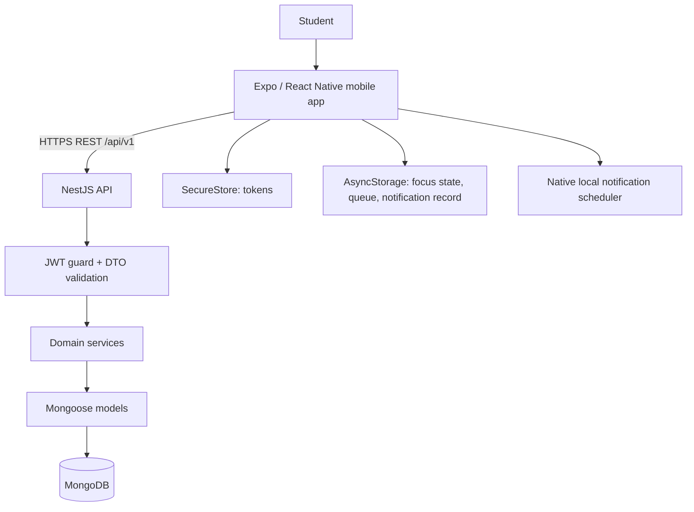
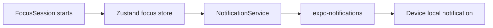
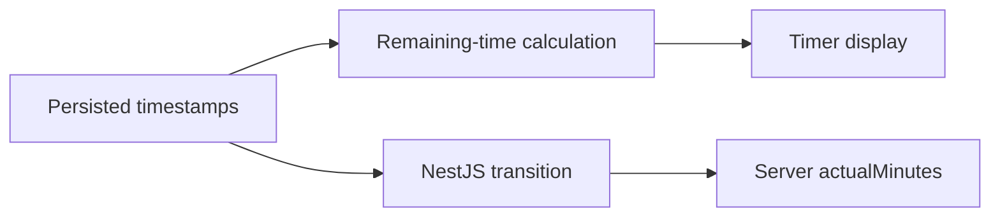

# Architecture

## System Overview

Study Focus App is an npm-workspaces monorepo with an Expo mobile client and a NestJS REST API.



## Repository Boundaries

- `apps/mobile`: Expo SDK 57 / React Native 0.86 application.
- `apps/api`: NestJS 11 REST API and Mongoose schemas.
- `packages/shared`: shared defaults, reminder intervals, focus status and envelope types. Apps currently do **not** import this package.
- `packages/config`: shared TypeScript base configuration. Apps currently do **not** extend it.
- `.github/workflows/ci.yml`: Node 22 validation with MongoDB 8 service.

## Mobile Architecture

- **Routing:** Expo Router file-based routes in `apps/mobile/src/app`.
- **Server state:** TanStack Query with one process-local `QueryClient`; cache is not persisted.
- **Focus/auth state:** Zustand stores. Focus state uses Zustand `persist` with AsyncStorage.
- **HTTP:** Axios in `services/api.ts`; access token injection and one-retry refresh interceptor.
- **Credentials:** Expo SecureStore.
- **Validation:** Zod and React Hook Form are used on login/register only (manual `safeParse`, no zodResolver). Other screens use component state and server validation.
- **Notifications:** `expo-notifications`, scheduled entirely on device.
- **Connectivity:** NetInfo triggers queue flush on reconnect.

## API Architecture

`AppModule` imports `DatabaseModule`, `AuthModule`, `SubjectsModule`, `TasksModule`, `TimetableModule`, `FocusModule`, `SettingsModule`, and `AnalyticsModule`.

Global behavior in `main.ts`:

- prefix: `/api/v1`
- `ValidationPipe`: transform, whitelist, and reject non-whitelisted properties
- success envelope interceptor
- exception filter with stable error envelope
- CORS from comma-split `CORS_ORIGIN` (default `*` becomes `["*"]`, which may not match the CORS wildcard scalar)
- Pino HTTP logging with password/token/authorization redaction
- listener: `0.0.0.0:${API_PORT}` (default 3000)

## Database Architecture

MongoDB is accessed through Mongoose 9 and `@nestjs/mongoose`. Models are defined in `apps/api/src/schemas/index.ts`. Ownership is represented by `userId` references and enforced in service queries using the authenticated JWT subject. Focus distractions are embedded in their session because they are session-owned, small, and read/aggregated with that session.

See [DATABASE.md](DATABASE.md).

## Authentication Flow

```mermaid
sequenceDiagram
  participant Mobile
  participant API
  participant MongoDB
  Mobile->>API: register/login
  API->>MongoDB: verify/create user; bcrypt password
  API->>MongoDB: store bcrypt hash of refresh token
  API-->>Mobile: access + refresh tokens
  Mobile->>Mobile: save both in SecureStore
  Mobile->>API: Bearer access token
  API-->>Mobile: protected resource
  Mobile->>API: refresh token after 401
  API->>MongoDB: verify stored refresh-token hash
  API-->>Mobile: rotated token pair
```

The backend trusts only `sub` from a validated access JWT for ownership. Client-supplied `userId` is neither accepted nor used.

## Focus and Notification Paths



Notifications do not pass through NestJS, MongoDB, cron, or a push provider. This preserves reminders when the API/network is unavailable and keeps checkpoint lifecycle coupled to the active local session.



A one-second UI interval only causes re-rendering. It is not authoritative timekeeping.

## Offline Synchronization

The focus store persists `session` and `lastCompleted` under `@study-focus/focus-store/v1`. Network failures create/update a single queued `/focus-sessions/sync` snapshot keyed by local session ID. The server stores `clientSessionId` under a unique `(userId, clientSessionId)` partial index, validates a seven-day sync window, computes duration, and returns an idempotent existing terminal session. Startup and NetInfo reconnect call `flushOfflineQueue`; the returned remote ID replaces the local ID in the store.

This is bounded focus-session recovery, not general offline-first CRUD or conflict resolution.

## Architectural Invariants

1. MongoDB/Mongoose is the persistence architecture; no Prisma migrations exist.
2. All protected API resources are filtered by authenticated `userId`.
3. At most one server-side open focus session exists per user.
4. Only completed sessions count toward analytics.
5. Timetable data never auto-creates study history.
6. Local notification lifecycle follows accepted local/server focus transitions, with reconciliation as stale-schedule cleanup.
7. Offline sync must remain idempotent via `clientSessionId`.
