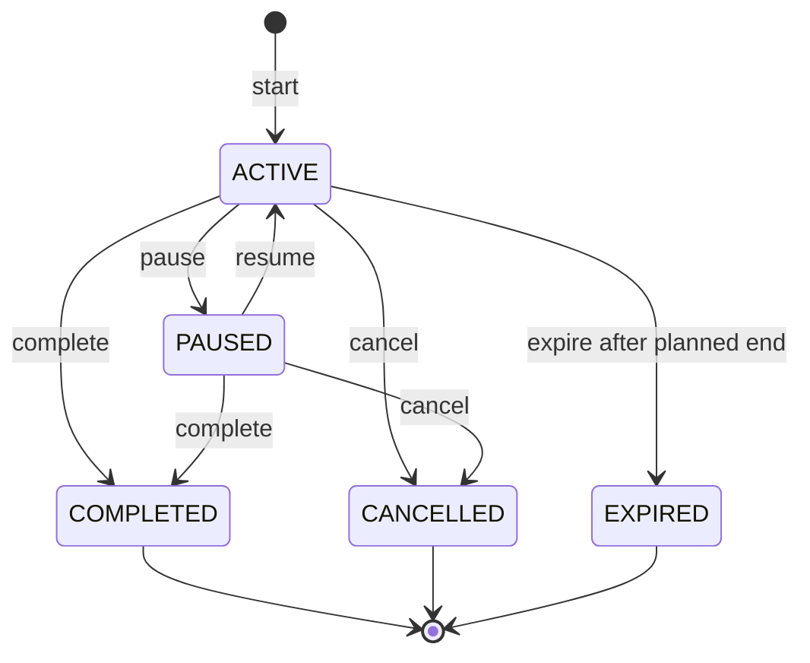

# Focus Session Engine

The focus engine is the central domain. Backend source: `apps/api/src/focus.ts` and `focus-state.ts`. Mobile source: `apps/mobile/src/stores/focus-store.ts` and focus screens.

## States and Transitions



Terminal states have no outgoing transitions. `PAUSED -> EXPIRED` is not valid in current code.

## Start

Online `POST /focus-sessions`:

1. validates optional subject/task ownership and task-subject consistency
2. checks no owned session is `ACTIVE`/`PAUSED`
3. reads user defaults when duration/interval are absent
4. uses server current time for `startedAt`
5. creates `ACTIVE`

The unique partial database index is the final concurrency guard against two open sessions.

Mobile start first calls the API. A connection failure creates a local ID (`local-<time>-<random>`), local timestamps, persists it, queues an idempotent sync snapshot, and schedules local reminders.

## Pause and Resume

Pause requires `ACTIVE`, sets `PAUSED` and `pausedAt`. Mobile cancels reminders.

Resume requires `PAUSED`, calculates the pending pause duration, adds it to accumulated paused time, clears `pausedAt`, returns to `ACTIVE`, extends mobile `endsAt`, and schedules a new reminder plan.

Completing/canceling while paused first accounts for the pending pause.

## Completion, Cancellation, Expiration

All close operations set `endedAt` and compute timing fields.

- `COMPLETED`: intentional finish; included in analytics.
- `CANCELLED`: abandoned/terminated; excluded from analytics.
- `EXPIRED`: planned active duration elapsed; excluded from analytics. Backend rejects premature expiration.

Mobile automatically attempts `expire` when an active persisted session has no remaining time during reconciliation.

## Time Calculation

Backend:

```text
actualSeconds =
  max(0, endedAt - startedAt - totalPausedSeconds - pendingPauseSeconds)
actualMinutes = floor(actualSeconds / 60)
completionPercentage =
  min(100, round(actualMinutes / plannedMinutes * 100))
```

The percentage is intentionally capped at 100 even if the session exceeds its plan.

Mobile computes provisional offline minutes using millisecond timestamps, but the server recomputes them when the snapshot syncs.

### Why timestamps are authoritative

React Native intervals may be delayed or suspended while backgrounded. The active screen's render interval updates the display only. `startedAt`, pause accumulation, and current/end time make app background/foreground and restart behavior deterministic.

## Distractions

Backend permits `PHONE`, `SOCIAL_MEDIA`, `MESSAGING`, `FATIGUE`, `OTHER` plus optional note while a session is open. It appends an embedded event and increments `distractionCount`.

Current mobile recovery records `OTHER` without a note, increments local count, and displays a return-to-work modal. Offline events retain occurrence timestamps in the sync snapshot.

## App Lifecycle Recovery

- Focus state is persisted in AsyncStorage.
- Root layout waits for hydration and calls `reconcile`.
- If synced, reconcile fetches current server state.
- Server-completed state moves to `lastCompleted`; canceled/expired clears local active state.
- Active elapsed state attempts expiry.
- Notification reconciliation removes stale schedules or reconstructs missing schedules.
- AppState foreground runs notification reconciliation again.

## Offline Synchronization

Unsynced sessions are represented as one latest snapshot queued at `/focus-sessions/sync`, not a chain of local transition commands.

Server rules:

- `clientSessionId` required and unique per user
- start no older than seven days and no more than one minute in future
- end not before start or significantly in future
- paused state requires valid `pausedAt`
- terminal state requires `endedAt`
- paused seconds cannot exceed elapsed seconds
- relationships must be owned
- terminal replay returns existing record unchanged
- **does not** run the normal transition machine: an existing open session can be overwritten with any supplied status from the snapshot
- last submitted open-session payload wins; there is no revision, merge, or clock
- a second open snapshot with a different client ID still conflicts with the one-open-session index

The response's server ID replaces the local ID in active/summary state.

For an online-created session that loses connectivity later, the mobile currently queues individual transition endpoints because it already has a server ID. Replay is sequential.

## Important Fields

- `plannedMinutes`: intended active duration.
- `actualMinutes`: server-derived whole active minutes.
- `startedAt`, `endedAt`, `pausedAt`: absolute timestamps.
- `totalPausedSeconds`: completed pauses.
- `completionPercentage`: capped progress.
- `reminderIntervalMinutes`: persisted preference for device scheduler.
- `distractionCount`: analytics-friendly count synchronized with embedded events.
- `clientSessionId`: offline idempotency key.

## Edge Cases

- **Duplicate start:** service check + partial unique index; returns 409.
- **Invalid transition:** 409; no state mutation.
- **Task from another subject/user:** 400.
- **Background:** native reminders remain scheduled; display recalculates on return.
- **Restart:** persisted store and server/notification reconciliation.
- **Complete offline:** terminal snapshot queued; server derives time.
- **Repeated offline replay:** idempotent per user/client ID.
- **Premature expire:** rejected.
- **Timer overrun:** completion remains possible; percentage caps at 100.
- **Permanent queued failure:** currently blocks later queue entries; documented limitation.

## Invariants

- One open server session per user.
- Terminal state is irreversible.
- Client `actualMinutes` is never accepted as the authoritative online completion value.
- A task must belong to the chosen subject when both are supplied.
- Notifications are canceled after accepted local/server transitions whenever the local session is not active; foreground/startup reconciliation cleans stale schedules. A non-network transition failure currently throws before cancellation.
- Only `COMPLETED` contributes to analytics/streaks.
