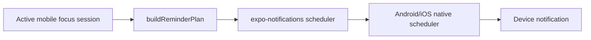

# Local Focus Notifications

## Critical Boundary

The checkpoint system is a **mobile native local notification system** implemented with `expo-notifications`. It is not a NestJS cron job, MongoDB job, remote push message, or server timer.



The backend only persists `reminderIntervalMinutes`.

## Files

- `apps/mobile/src/services/notification-plan.ts` — pure plan/identifier helpers.
- `apps/mobile/src/services/notification-service.ts` — OS integration.
- `apps/mobile/scripts/test-notification-plan.ts` — deterministic plan/filter assertions.
- `apps/mobile/app.json` — Expo plugin and default Android channel.
- `apps/mobile/src/stores/focus-store.ts` — lifecycle calls.
- `apps/mobile/src/app/focus/active.tsx` — permission/next-reminder status.

## Initialization and Android Channel

Root layout calls `NotificationService.initialize()`.

Foreground handler:

- shows banner/list
- no sound
- no badge

Android channel `focus-reminders`:

- name `Focus reminders`
- default importance
- vibration pattern `[0,150]`
- light color `#7ED6AC`

`app.json` also declares `defaultChannel: focus-reminders`.

## Permission

`requestPermission()`:

1. returns false on web
2. reads current permission
3. returns true if already granted
4. otherwise asks the OS and returns grant result

Scheduling returns false when permission is unavailable. Active UI can show granted/denied/undetermined status.

## Plan and Identifiers

`buildReminderPlan(sessionId, now, endsAt, intervalMinutes)` creates date triggers at:

```text
now + interval, now + 2*interval, ... strictly before endsAt
```

Stable identifier:

```text
focus-<sessionId>-<firesAtEpochMs>
```

Notification data:

```json
{ "sessionId": "...", "kind": "focus-reminder" }
```

Title: `Return to your focus`. Body includes the subject name.

The stable metadata allows discovery/cancellation even if the local record is stale.

## Production and Development Intervals

- Production-accepted choices in mobile: 5, 10, 15, 20, 25, 30 minutes.
- Production default: **10 minutes**.
- One minute is accepted only when `__DEV__`, the caller explicitly opts in, and the session interval is 1.

The development interval must never silently become a production default.

## Persisted Scheduling Record

AsyncStorage key: `@study-focus/notifications/v1`.

Fields:

- session ID
- returned native notification IDs
- planned fire timestamps
- interval
- device timezone

Only one focus notification record is maintained because the product permits one current focus session.

## Duplicate Prevention and Reconciliation

Before retaining an existing plan, the service checks:

- same session
- same interval
- same timezone
- planned timestamps exist
- every future recorded identifier still exists in OS scheduled notifications

If any condition fails, it cancels focus reminders and rebuilds the plan. Reconciliation runs after focus-store hydration and whenever AppState becomes active.

## Lifecycle Rules

| Focus action | Notification behavior |
|---|---|
| Start active | Request permission and schedule all remaining checkpoints |
| Pause | Cancel all notifications for that session |
| Resume | Recalculate adjusted end and schedule new remaining checkpoints |
| Complete | Cancel session notifications |
| Cancel | Cancel session notifications |
| Expire | Cancel session notifications |
| App restart/foreground | Reconcile persisted session, record, timezone, and native schedule |
| No/terminal session | Remove stale focus reminders |

`cancelSession` combines IDs from the persisted record with native scheduled notifications whose data has `kind=focus-reminder`, deduplicates, and cancels each defensively.

INVARIANT: after a successful or locally accepted transition, focus reminders must not remain scheduled when a session is paused or terminal. Reconciliation removes stale schedules. Current caveat: a non-network API transition error throws before the focus-store cancellation call, so the previous schedule can temporarily remain until reconciliation or another accepted action.

## Implemented vs Runtime Verified

### Implemented and statically/automatically verified

- permission code
- Android channel configuration
- deterministic date plans
- session-associated stable IDs
- scheduling and cancellation code
- duplicate checks
- restart/foreground reconciliation
- production/default/dev interval rules
- pure plan and reminder-filter test script
- TypeScript/lint/Expo Doctor validation

### Not runtime verified

Native notification delivery remains unverified because no Android device/emulator is currently available. The notification implementation is complete but requires a physical Android device or emulator for runtime verification.

Do not install an emulator/system image solely to continue unrelated development, and do not claim OS delivery has passed until the device acceptance steps are performed.

## Future Device Acceptance Test

1. Set `EXPO_PUBLIC_API_URL` to a device-reachable API URL.
2. Use a physical Android device or an already-available emulator.
3. Grant notification permission.
4. In a development build, start a session with the explicit one-minute test option.
5. Background the app; verify delivery.
6. Pause; verify no later reminder.
7. Resume; verify a new schedule.
8. restart/foreground; verify no duplicates.
9. complete/cancel; inspect that all session reminders are gone.
10. repeat with denied permission and production 10-minute default.

## Current Preference Gaps

`userSettings.notificationsEnabled`, `soundEnabled`, and `vibrationEnabled` are persisted, but scheduling does not consistently fetch/gate on `notificationsEnabled`, notification content always requests no sound, and the channel vibration pattern is static. Treat these settings as partially wired until implementation and device tests are completed.
